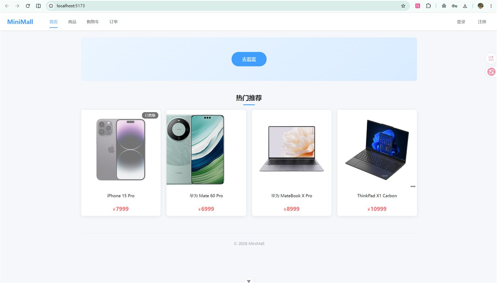
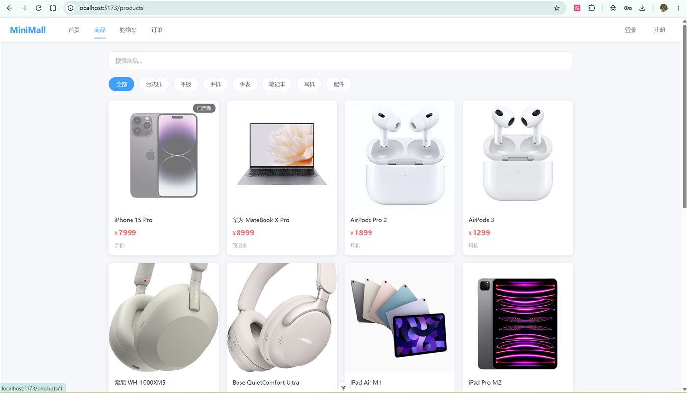
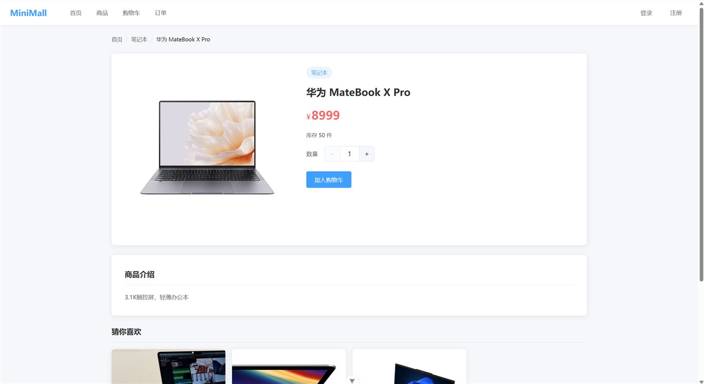
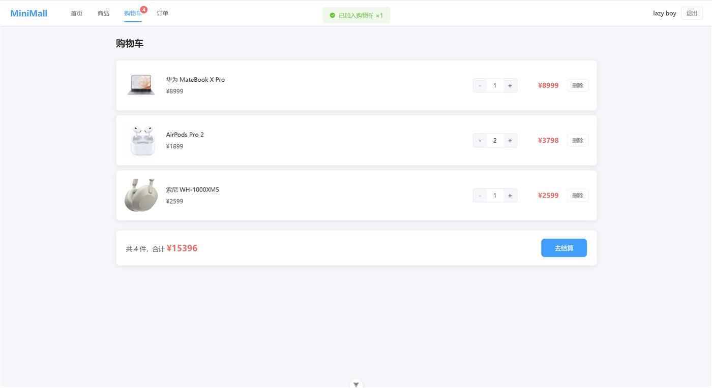
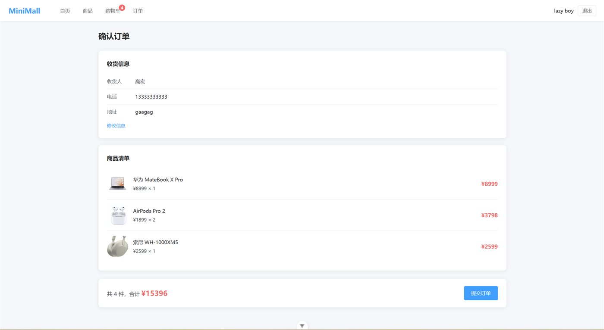
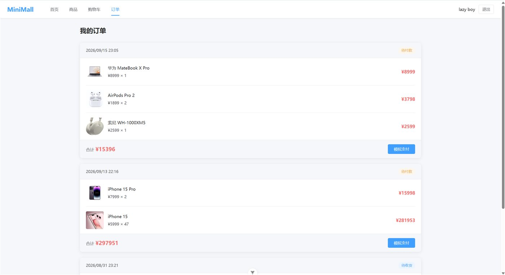

# MiniMall 前端

基于 Vue 3 + TypeScript + Vite 的迷你商城前端，覆盖「浏览商品 → 加入购物车 → 结算下单 → 订单状态流转」的完整业务闭环。

- 在线预览：http://8.149.237.91
- 配套后端：[mini-mall-server](https://github.com/hgao2930-cloud/mini-mall-server)

## 项目截图

<table>
  <tr>
    <td width="50%"></td>
    <td width="50%"></td>
  </tr>
  <tr>
    <td width="50%"></td>
    <td width="50%"></td>
  </tr>
  <tr>
    <td width="50%"></td>
    <td width="50%"></td>
  </tr>
</table>

## 技术栈

- Vue 3（Composition API + `<script setup>`）+ TypeScript
- Vite：开发服务器与构建（开发环境通过 proxy 把 `/api` 转发到后端，生产环境由 Nginx 反向代理）
- Vue Router 4：路由懒加载、登录守卫、404 兜底
- Pinia：`auth` / `cart` / `userinfo` 三个 store
- Element Plus：表单、弹窗、消息提示
- Axios：统一请求实例、401 处理、错误信息提取
- 工程化：ESLint + oxlint + Prettier + vue-tsc

## 功能

### 商品

- 列表页：**后端分页 + 触底加载**（IntersectionObserver 哨兵）、关键词搜索（输入防抖 + 后端建议下拉）、分类筛选（分类来自独立接口）
- 详情页：商品信息、库存展示、猜你喜欢（同类推荐）
- 售罄处理：库存为 0 时展示「已售罄」角标 + 图片灰化，详情页禁用加购与数量增减

### 购物车

- 数据存储在服务端 `cart` 表（用户 + 商品唯一），前端只维护展示副本
- 支持加购（同商品自动累加）、数量增减、单条删除、清空
- 未登录访问由路由守卫拦截

### 订单

- 结算：校验收货信息后提交订单，金额与商品快照由服务端生成
- 库存不足时展示后端返回的具体原因（409）
- 订单列表按状态展示操作按钮：待付款 → 待收货 → 已完成
- 下单成功后清空购物车（接口异常时本地兜底清空，避免重复结算）

### 用户与鉴权

- 注册 / 登录：密码由后端 bcrypt 加密，JWT 写入 **httpOnly cookie**，前端不接触 token
- 会话恢复：应用启动时请求 `/api/auth/me`，未登录返回 `user: null` 进入游客态
- 路由守卫：购物车 / 订单 / 结算 / 个人中心需登录；登录页对已登录用户不开放
- 个人中心：收货信息编辑，姓名 / 手机号 / 地址前后端双重校验
- 登出：清空本地登录态与收货信息缓存

## 关键设计

- **数据分层**：接口响应只读；页面状态（列表、页码、加载状态）独立维护；派生数据用 `computed` 生成，不在来源数据上原地修改
- **请求竞态处理**：用请求序号（筛选代次 + 请求 ID）标记每次请求，过期响应直接丢弃，避免「滚动加载与切换筛选互相污染」「旧响应覆盖新结果」
- **列表四态**：加载中 / 错误 / 空数据 / 正常；重新筛选时保留旧列表并显示轻量 loading
- **401 处理**：统一拦截 401，清空本地登录态并跳转登录页

## 本地启动

前置要求：Node.js 22+；后端服务已启动（见 [mini-mall-server](https://github.com/hgao2930-cloud/mini-mall-server)）。

```bash
npm install
npm run dev     # http://localhost:5173
```

开发环境下 Vite 会把 `/api` 请求代理到 `http://localhost:3000`（见 `vite.config.ts`）。

## 常用脚本

| 命令 | 说明 |
|---|---|
| `npm run dev` | 启动开发服务器 |
| `npm run build` | 类型检查 + 生产构建（产物在 `dist/`） |
| `npm run type-check` | vue-tsc 类型检查 |
| `npm run lint` | oxlint + ESLint |
| `npm run format` | Prettier 格式化 |

## 部署

本地构建后，将 `dist/` 上传到服务器的 Nginx 静态目录；Nginx 同时负责静态文件与 `/api` 反向代理：

```bash
npm run build
scp -r ./dist/* root@<服务器IP>:/var/www/minimall/
```

## 目录结构

```
src/
├── api/            # axios 实例与各模块接口（auth / products / cart / order）
├── components/     # 通用组件（NavBar）
├── composables/    # useAsyncData（请求三态）、debounce、useAsyncAction
├── router/         # 路由配置与登录守卫
├── stores/         # Pinia：auth / cart / userinfo
├── utils/          # 错误提示工具
    ├── views/          # 页面：首页 / 商品列表 / 商品详情 / 购物车 / 结算 / 订单 / 登录 / 注册 / 个人中心
    └── styles/         # 全局样式与主题变量
```

## 素材说明

项目中的商品图片来源于网络，仅用于学习与演示，版权归原作者所有；如有侵权请联系删除。
